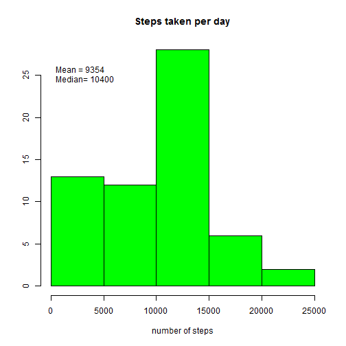
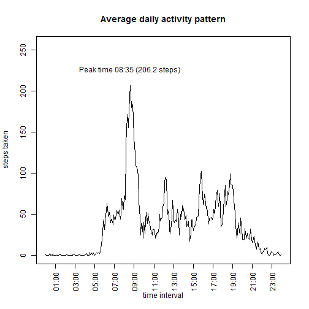
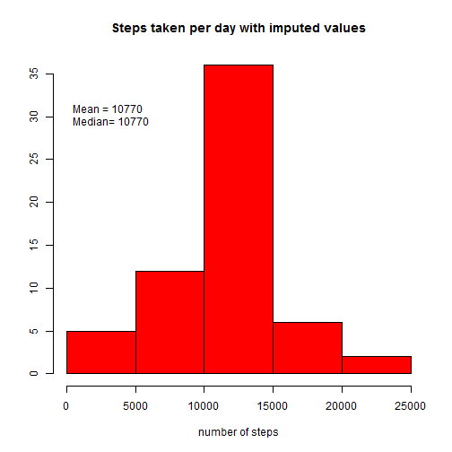
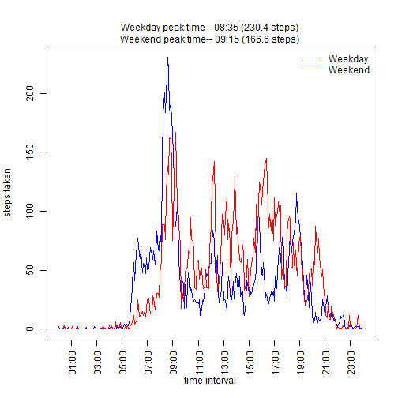

## Loading and preprocessing the data  

Load and read data into a dataset and set the class of the "date" column to be "Date". 

```r
unzip("activity.zip")
Activity <- read.csv("activity.csv", stringsAsFactors=FALSE)
Activity$date <- as.Date(Activity$date)
```


## What is mean total number of steps taken per day?  

1. Calculate the total number of steps taken per day. (Ignore the missing values for now.)  
2. Calculate the mean and median of the total number of steps taken per day.

```r
StepsPerDay <- tapply(Activity$steps, Activity$date, sum, na.rm=TRUE)
StepSum <- summary(StepsPerDay)
```

3. Make a histogram of the total number of steps taken each day. 
   Report the mean and median of the total number of steps taken per day on the figure.  

```r
hist(StepsPerDay, main="Steps taken per day", xlab="number of steps", ylab=NA, col="green")
  text(10, 25, paste("Mean =", StepSum["Mean"], "\nMedian=", StepSum["Median"]), pos=4)
```

 


## What is the average daily activity pattern?

calculate steps taken at each time interval across all dates  

```r
StepsOverTime <- tapply(Activity$steps, Activity$interval, mean, na.rm=TRUE)
```

1. Make a time series plot (type = "l") of the 5-minute interval (x-axis) and the average number 
   of steps taken, averaged across all days (y-axis).  
2. Report on the figure as "peak", Which 5-minute interval, on average across all the days in the
   dataset, contains the maximum number of steps.  

```r
plot(StepsOverTime, type="l", xaxt="n", xlab="time interval", ylab="steps taken", ylim=c(0, max(StepsOverTime)+50), main="Average daily activity pattern")
  
  peak <- which(StepsOverTime==max(StepsOverTime))
  #change interval into time by 1) stick 0s into all numbers to make them 4 digits
  # 2) change to date-time format, and 3) pick character 12-16, which is the time
  times <- substr(as.POSIXct(sprintf("%04.0f", as.numeric(names(StepsOverTime))), format="%H%M"), 12, 16)
  #define positions of round hours for x axis labeling
  rdhour <- 24*c(1:12)-11
  axis(1, times[rdhour], at=rdhour, las=2)
  text(peak, max(StepsOverTime)+20, paste("Peak time ", times[peak], " (", round(max(StepsOverTime),1), " steps)",sep=""))
```

 


## Imputing missing values

1. Calculate and report the total number of missing values in the dataset (i.e. the total number of rows with NAs)  

```r
WhichNA <- which(is.na(Activity$steps))
paste("There are", length(WhichNA), "missing values in the dataset!")
```

```
## [1] "There are 2304 missing values in the dataset!"
```
 

2. Devise a strategy for filling in all of the missing values in the dataset. I will use the mean value for that 5-minute interval calculated above (StepsOverTime).  

3. Create a new dataset that is equal to the original dataset but with the missing data filled in.  

```r
SubAct <- Activity

for (i in 1:length(WhichNA)) {
  x <- WhichNA[i]
  SubAct[x, 1] <- StepsOverTime[as.character(SubAct[x,3])]
}
```

4. Make a histogram of the total number of steps taken each day and Calculate and report the mean and median total number of steps taken per day.  

```r
NewSPD <- tapply(SubAct$steps, SubAct$date, sum)
NewSum <- summary(NewSPD)

hist(NewSPD, main="Steps taken per day with imputed values", xlab="number of steps", ylab=NA, col="red")
  text(10, 30, paste("Mean =", NewSum["Mean"], "\nMedian=", NewSum["Median"]), pos=4)
```

 

Conclusion: the mean and median differ from the estimates from the first part of the assignment. Because the missing values were treated as 0, the calculated mean and median values are probably underestimated; while imputing missing data corrected this bias of underestimation.


## Are there differences in activity patterns between weekdays and weekends?  

1. Create a new factor variable in the dataset with two levels - "weekday" and "weekend" indicating whether a given date is a weekday or weekend day.  

```r
SubAct$Weekday <- weekdays(SubAct$date)
  #Replacing Monday-Friday as "Weekday" and Saturday and Sunday as "Weekend"
  wke <- which(SubAct$Weekday=="Saturday"|SubAct$Weekday=="Sunday")
    SubAct$Weekday[wke] <- "Weekend"
    SubAct$Weekday[-wke] <-"Weekday"
  SubAct$Weekday <- as.factor(SubAct$Weekday)
```

2. Make a panel plot containing a time series plot (type = "l") of the 5-minute interval (x-axis) and the average number of steps taken, averaged across all weekday days or weekend days (y-axis). Report peak time-interval and number of steps taken at the time interval for both weekdays and weekends above the figure.  

```r
#calculate average steps taken per interval on the weekdays and weekends
wksteps <- tapply(SubAct$steps, list(SubAct$interval, SubAct$Weekday), mean)
wksteps <- as.data.frame(wksteps)

plot(wksteps$Weekday, type="l", col="blue", xaxt="n", xlab="time interval", ylab="steps taken", ylim=c(0, max(wksteps$Weekday)+30))
  lines(wksteps$Weekend, type="l", col="red")
  axis(1, times[rdhour], at=rdhour, las=2)
  legend("topright", names(wksteps), lty=1, col=c("blue", "red"), bty="n")

  #add text above the figure since there is not much space within the border
  wkpeak <- which(wksteps$Weekday == max(wksteps$Weekday))
  wdpeak <- which(wksteps$Weekend == max(wksteps$Weekend))
    mtext(paste("Weekday peak time ", times[wkpeak]," (", round(max(wksteps$Weekday),1), " steps)", sep=""), side=3, line=1.2)
    mtext(paste("Weekend peak time ", times[wdpeak]," (", round(max(wksteps$Weekend),1), " steps)", sep=""), side=3, line=0.2)
```

 
